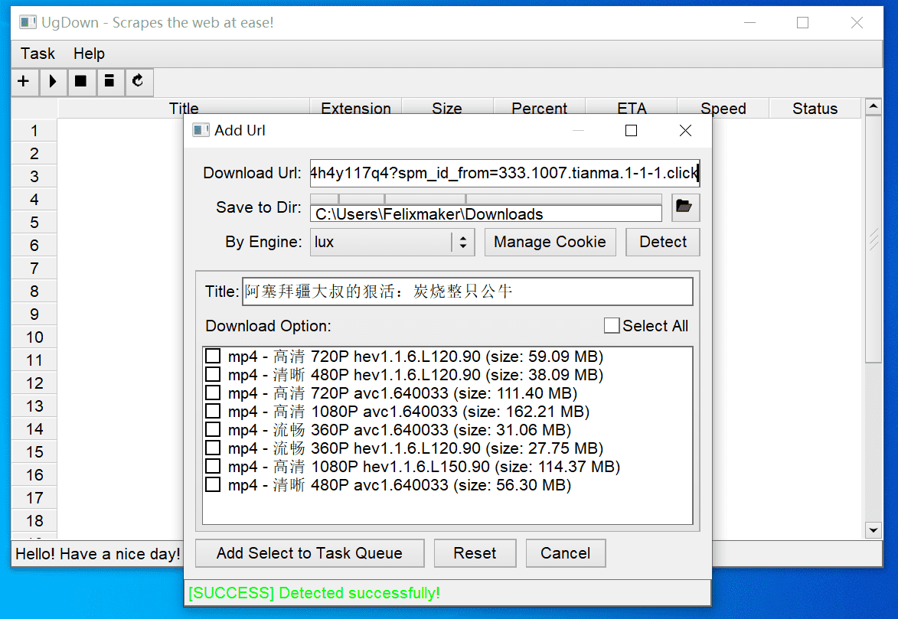

# ugdown

Yet another gui for you-get, lux, youtube-dl and more! Use it to scrapes the web at ease!

The current beta release is `v0.2.x`.

## Todo List

 - [ ] playlist support
 - [ ] option(name, cookie...)
 - [ ] more readable code and fix bug
 - [ ] i18n support

This project is still under development. You can see the development progress in this repo.

## Notice

 1. Ugdown is based in part on the work of the FLTK project (https://www.fltk.org).
 2. You need to install you-get, lux or youtube-dl before using ugdown, see the prerequirements below.

## Prerequirements

You need at leate one of them to make the program work!

 - [you-get](https://github.com/soimort/you-get/)
 - [lux](https://github.com/iawia002/lux/)
 - [youtube-dl](https://github.com/ytdl-org/youtube-dl)
